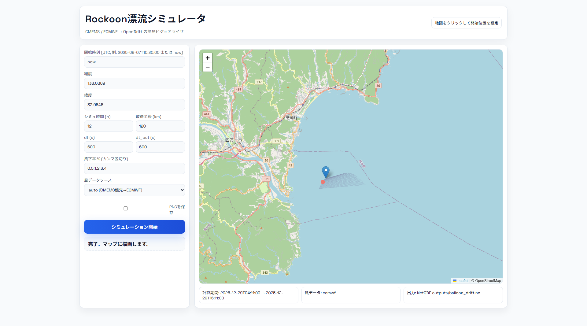

# Rockoon drift simulator (CMEMS → OpenDrift)

気球が海上に落下した後の漂流を **CMEMS/ECMWF の海流・風・波データ → OpenDrift (OceanDrift)** で計算するツールです。Web UI と CLI のどちらでも実行できます。



## 特徴
- CMEMS/ECMWF のサブセット取得、NetCDF 検証、OpenDrift 実行、出力生成を分離し、頑健に再試行。
- 取得データの時間範囲が欠けていても可能な範囲で自動リトライ。
- `run_manifest.json` に使用データセット・時刻範囲・パラメータを記録。
- 既存のダウンロードをキャッシュ再利用して高速化。

## セットアップ (推奨: venv)
```bash
python -m venv .venv
source .venv/bin/activate  # Windows: .\.venv\Scripts\activate
pip install -U pip
pip install opendrift==1.14.3 xarray netcdf4 pandas numpy copernicus-marine-client
# PNG が欲しい場合: pip install matplotlib cartopy
```

### CMEMS ログイン（初回のみ）
```bash
copernicusmarine login
copernicusmarine whoami
```

## 使い方
### 1) Web UI（デフォルト動作）
```bash
python cli.py --open-browser   # または引数なしで python cli.py
```
ブラウザで開き、地図をクリックして開始点を置き、UTC 時刻とシミュ時間を入力し「シミュレーション開始」。結果はマップに描画され、出力ファイルも保存されます。

### 2) CLI 実行例
```bash
python cli.py \
	--lon 135.0 --lat 33.5 \
	--time-utc 2025-09-07T10:30:00 \
	--hours 12 \
	--pretty-png
```

## 主なオプション（抜粋）
- `--hours` 漂流計算する時間 [h]
- `--radius-km` 取得するデータの半径 [km]
- `--dt`, `--dt-out` OpenDrift の時間刻み / 出力間隔 [s]
- `--windage` 風下率の一覧（カンマ区切り）。例: `0.5,1,2,3,4`
- 風/波の切り替え: `--no-wind`, `--no-waves`, `--const-wind-only`, `--const-waves-only`
- 風ソース: `--wind-source auto|cmems|ecmwf`
- キャッシュ: `--cache-dir ./copernicus-cache`（デフォルト）
- 強制再取得: `--force-download`（通常は付けない）

## キャッシュと再利用
- ダウンロード結果は `./copernicus-cache` 配下にハッシュ付きファイル名で保存されます。
- 同じパラメータ・時間範囲で再実行する場合、キャッシュが自動で再利用され、取得時間を短縮できます。
- 再取得したい場合のみ `--force-download` を付けてください。

## 出力
- NetCDF: `outputs/balloon_drift.nc`
- CSV: `outputs/balloon_positions_mean.csv`, `outputs/balloon_positions_all.csv`
- マニフェスト: `outputs/run_manifest.json`（使ったデータとパラメータを記録）
- オプション: `--pretty-png` を付けると `outputs/balloon_drift_pretty.png`

## トラブルシュート
- `copernicusmarine` が見つからない: `pip install copernicus-marine-client` を venv で実行し、`copernicusmarine --help` が通るか確認。
- ECMWF 風を使う場合で `ecmwf-opendata` 未導入: `pip install ecmwf-opendata`。GRIB→NetCDF 変換には `cfgrib` と `eccodes` が必要です。
- 取得範囲外の時刻を指定すると自動で近い範囲にシフトします。どうしても失敗する場合は時間を短くするか開始時刻をずらしてください。
